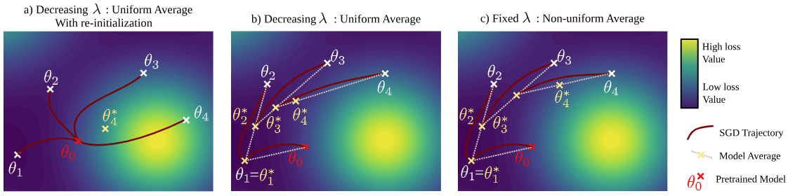

<div align="center">
  <div>
  <h1>Weighted Ensemble Models Are Strong Continual Learners</h1> 

[](https://arxiv.org/abs/2312.08977)

  </div>

</div>

<div align="center">

<div>
    <a href='' target='_blank'>Imad Eddine MAROUF</a><sup>1</sup>&emsp;
    <a href='' target='_blank'>Subhankar Roy</a><sup>2</sup>&emsp;
    <a href='' target='_blank'>Enzo Tartaglione</a><sup>1</sup>&emsp;
    <a href='' target='_blank'>Stéphane Lathuilière </a><sup>1</sup>
</div>
<div>
<sup>1</sup>Telecom-Paris, Institut Polytechnique de Paris&emsp;

<sup>2</sup>University of Trento, Italy&emsp;
</div>
</div>

The code repository for "[Weighted Ensemble Models Are Strong Continual Learners](https://arxiv.org/abs/2312.08977)" in PyTorch.

📣 Published as a conference paper at ECCV 2024

## Updates  
📌 **Our method has been added to the PILOT library**: [LAMDA-PILOT](https://github.com/sun-hailong/LAMDA-PILOT).

## Abstract
In this work, we study the problem of continual learning (CL) where the goal is to learn a model on a 
sequence of tasks, with the data from previous tasks becoming unavailable while learning on the current
task data. CL is essentially a balancing act between learning new tasks (plasticity) and maintaining 
performance on previously learned concepts (stability). To address the stability-plasticity trade-off, 
we propose performing weight-ensembling of the model parameters of the previous and current task. 
This weight-ensembled model, which we call Continual Model Averaging (or CoMA), achieves high accuracy 
on the current task without deviating significantly from the previous weight configuration, ensuring stability. 
We also propose an improved variant of CoMA, named Continual 
Fisher-weighted Model Averaging (or CoFiMA), that selectively weighs each parameter in the weight ensemble 
by leveraging the Fisher information of the model's weights. Both variants are conceptually simple, easy to 
implement, and effective in achieving state-of-the-art performance on several standard CL benchmarks.


<p align="center">
  
</p>

## Requirement
install the conda environment using the environment.yml file

```conda env create --file environement.yml```

## Pre-trained Models

Please download pre-trained ViT-Base models from [MoCo v3](https://drive.google.com/file/d/1bshDu4jEKztZZvwpTVXSAuCsDoXwCkfy/view?usp=share_link) and [ImageNet-21K](https://drive.google.com/file/d/1PcAOf0tJYs1FVDpj-7lrkSuwXTJXVmuk/view?usp=share_link) and 
then put or link the pre-trained models to ```CoFiMA/pretrained```


## Dataset Preparation
For downloading and preparing the datasets used in our experiments, please refer to the instructions provided in [LAMDA-PILOT](https://github.com/sun-hailong/LAMDA-PILOT). 
This repository contains detailed steps for setting up the standard continual learning benchmarks.

## Training
to launch the training of CoMA or CoFiMA on CIFAR-100, run the following command:

```python main.py --config exps/cofima/cofima_cifar.json```

```python main.py --config exps/cofima/cofima_imgnetr.json```

## Log file 

The default log file for CoFiMA evaluated on the main benchmarks in Tab.1 are in ```CoFiMA/log.txt```

## Citation

If you find this work helpful, please cite our paper.

```bibtex
@misc{marouf2024weightedensemblemodelsstrong,
      title={Weighted Ensemble Models Are Strong Continual Learners}, 
      author={Imad Eddine Marouf and Subhankar Roy and Enzo Tartaglione and Stéphane Lathuilière},
      booktitle = {European Conference on Computer Vision (ECCV)},
      year    = {2024}
}
```

## Acknowledgment
This repo is heavily based on [PyCIL](https://github.com/G-U-N/PyCIL), [SLCA](https://github.com/GengDavid/SLCA), many thanks.
